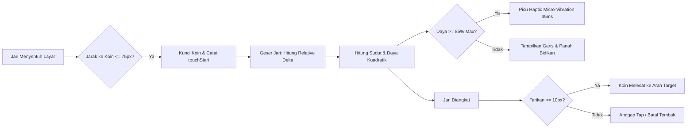

# 📱 Mobile Game Product Requirement Document (PRD)
# ⚡ BolaBola League - Mobile Compact Edition

**Nama Produk:** BolaBola League Mobile (Compact Edition)  
**Tipe Game:** Turn-Based Simultaneous Physics Tabletop Soccer (Bobblehead Coin Arcade)  
**Versi Dokumen:** v1.0.0 (Production-Ready Mobile Specification)  
**Target Platform:** 
1. **PWA Standalone (iOS Safari & Android Chrome)**
2. **Native Mobile App (Capacitor / WebView Android APK & iOS IPA)**
3. **Mobile Instant Play (Discord Activity / Telegram Mini Apps)**  
**Target Frame Rate:** 60 FPS – 120 FPS (High Refresh Rate Mobile Displays)  
**Target Orientasi:** Landscape Murni (Otomatis & Terkunci)

---

## 🎯 1. Visi Produk & Ringkasan Mobile UX

BolaBola League Mobile dirancang sebagai game sepak bola meja taktis berkecepatan tinggi dengan filosofi **"Instant Action, Compact Ergonomics, & Tactile Immersion"**. 

Game dioptimalkan secara radikal untuk **smartphone layar 4.7 inci hingga 6.9 inci** (iPhone SE, iPhone 12–16 Pro Max, Samsung Galaxy S/A Series, Xiaomi, Pixel, dsb.), mengutamakan jangkauan dua jempol (*Dual-Thumb Zone*), bebas lag, dan tidak membutuhkan instalasi berat.

### Pilar Utama Desain Mobile:
1. **Zero-Scroll, Zero-Clutter**: Seluruh komponen HUD, lapangan arena, dan tombol aksi muat 100% di layar tanpa geser (*zero scroll*) dalam rasio aspek 16:9 yang adaptif.
2. **Compact Thumb Reachability**: Tombol-tombol kritis (Ready, Ganti Koin, Menu) diletakkan di sudut jangkauan alami jempol tangan kanan dan kiri.
3. **Fisika Taktil Sentuh (Tactile Touch Slingshot)**: Sensasi tarikan ketapel berdaya kuadratik dengan umpan balik getaran mikro (*haptic micro-vibrations*).
4. **Instalasi Instan (PWA & Lightweight Native)**: Ukuran aset total di bawah 5 MB, dapat diinstal langsung ke homescreen atau toko aplikasi tanpa membebani memori HP.

---

## 📐 2. Arsitektur Ergonomi Tampilan Mobile Compact

```
┌────────────────────────────────────────────────────────────────────────┐
│ [🔴 The Strikers  2]        ⚡ TURN 14/90        [1  The Rovers 🔵] ⚙️⛶ │  <- Top Bar (40px)
├────────────────────────────────────────────────────────────────────────┤
│                                                                        │
│                                                                        │
│                      LAPANGAN SEPAK BOLA MEJA                          │
│                      (Virtual Canvas 960 x 540)                        │
│                   Aspect Ratio 16:9 • Auto Scale                       │
│                                                                        │
│                                                                        │
├────────────────────────────────────────────────────────────────────────┤
│ 🔴 [8][5][6][7]   ⏱️ Sisa: 08s | Ziggy #5   🔵 [3][1][4][2]  [ READY ✓ ]│  <- Bottom Bar (44px)
└────────────────────────────────────────────────────────────────────────┘
  ▲ Left Thumb Zone                                      ▲ Right Thumb Zone
```

### 2.1. Spesifikasi Komponen HUD Ramping:

| Elemen | Ukuran Desktop | Ukuran Mobile Compact (`max-height: 540px`) | Penyesuaian Ergonomi |
| :--- | :--- | :--- | :--- |
| **Top Bar Height** | 52px | **40px** | Padding kompak `0 10px`, border radius `12px`. |
| **Team Badges** | Lebar 140px | **Kompak 90px** | Ikon tim `28px`, font skor `20px` bold. |
| **Action Buttons** | 34px | **28px** | Ikon high-contrast (Home, Stats, Settings, Mute, Fullscreen). |
| **Bottom Bar Height** | 60px | **44px** | Menghemat ruang vertikal lapangan +18%. |
| **Roster Status Dots** | 32px | **24px** | Dot nomor punggung interaktif, ganti koin sekali sentuh. |
| **Tombol READY Lock** | 48px | **34px (Lebar 96px)** | Warna hijau terang menyala di sudut kanan bawah (jempol kanan). |
| **Arena Canvas Max Height**| `calc(100vh - 128px)` | **`calc(100dvh - 90px)`** | Memaksimalkan bidang pandang lapangan sepak bola meja. |

### 2.2. Proteksi Safe Area Inset (Notch & Dynamic Island):
Menggunakan CSS Environment Variables untuk menjamin elemen tidak terpotong kamera punch hole, notch, atau bilah gestur bawah:
```css
padding: env(safe-area-inset-top, 2px) 
         max(10px, env(safe-area-inset-right)) 
         env(safe-area-inset-bottom, 2px) 
         max(10px, env(safe-area-inset-left));
```

---

## 🕹️ 3. Mekanisme Kontrol Sentuh Smartphone (Slingshot Engine)

Sistem bidikan sentuh ponsel dirancang untuk memberikan akurasi tembakan layaknya stik biliar atau ketapel fisik:



### Karakteristik Kontrol Sentuh:
1. **Relative Delta Drag (Zero Phantom Jump)**:
   - Jarak tarikan dihitung dari titik pertama kali jari menempel pada layar (`touchStart`), bukan dari titik tengah koin.
   - Menghilangkan bug loncatan panah mendadak saat jari pemain menyentuh sisi tepi koin.
2. **Area Sentuh Luas (*Generous Hitbox*)**:
   - Radius seleksi diperlebar hingga `char.radius + 75px` virtual untuk mempermudah seleksi koin di layar kecil tanpa perlu presisi mikroskopis.
3. **Multi-Touch Isolation**:
   - Pelacakan sentuhan berbasis `activeTouchId`. Jika jempol lain secara tidak sengaja menyentuh layar, kontrol bidikan utama tidak terganggu.
4. **Dual Aiming Mode**:
   - **Mode Tarik Langsung (Direct Push)**: Geser ke depan menuju target sasaran.
   - **Mode Ketapel (Inverted Slingshot)**: Tarik mundur ke belakang untuk meluncur ke depan.
5. **Dynamic Deadzone (8px)**:
   - Mengabaikan goyangan mikro jari saat pemain hanya ingin melakukan *tap* memilih koin tanpa menembak.

---

## 🔄 4. Orientasi Otomatis & Fullscreen Immersive di iOS & Android

### 4.1. Solusi Layar Penuh iOS Safari (iPhone / iPad)
Karena iOS Safari tidak mendukung `Element.requestFullscreen()` untuk elemen DOM biasa, game mengaktifkan **Pseudo-Fullscreen Mode**:
- Menghitung tinggi layar menggunakan `100dvh` (*Dynamic Viewport Height*) yang menyesuaikan saat toolbar Safari collapse.
- Otomatis melakukan *micro-scroll* (`window.scrollTo(0, 1)`) saat mode horizontal aktif untuk menyembunyikan bilah URL.
- Memaksimalkan wrapper game ke `z-index: 99999` dan posisi fixed `0, 0, 100vw, 100vh`.

### 4.2. Smart Orientation Shield (Overlay Putar Ponsel)
Jika pemain membuka game dalam posisi vertikal (portrait), overlay modern muncul dengan animasi ponsel berputar:
- Memberikan instruksi visual untuk memutar ponsel ke horizontal.
- Tombol **"Paksa Putar Tampilan"** yang menerapkan transformasi CSS 90 derajat jika *auto-rotate* di sistem HP pemain terkunci.

---

## 📲 5. Arsitektur Progressive Web App (PWA) & Native Packaging

Game ini siap dijalankan dalam dua jalur distribusi:

### 5.1. PWA Standalone (Direct Web Install)
- **Manifest**: [`manifest.webmanifest`](file:///c:/xampp/htdocs/bolabola/manifest.webmanifest) terdaftar dengan `display: standalone` dan `orientation: landscape`.
- **Ikon Adaptif**: Aset resolusi tinggi 192px, 512px, Maskable, Apple Touch Icon (180px), dan SVG.
- **Offline Caching ([sw.js](file:///c:/xampp/htdocs/bolabola/sw.js))**: *Cache-First with Stale-While-Revalidate* yang memungkinkan game dimainkan tanpa koneksi internet (Singleplayer vs AI & Pass and Play).
- **Prompt Instalasi Cerdas**:
  - Di **Android Chrome**: Menampilkan tombol `📲 Pasang Aplikasi` yang memicu native prompt browser.
  - Di **iOS Safari**: Menampilkan modal visual 3 langkah (*Share ➔ Add to Home Screen*).

### 5.2. Native Packaging (Google Play Store & App Store)
Dengan arsitektur HTML5 Canvas Vanilla ES Modules bebas dependensi berat, game dapat dibungkus (*wrapper*) menggunakan **Capacitor.js**:
```bash
npm install @capacitor/core @capacitor/cli @capacitor/android @capacitor/ios
npx cap init "BolaBola League" "com.bolabola.league"
npx cap add android
npx cap add ios
```
- **Plugins Tambahan**:
  - `@capacitor/screen-orientation`: Mengunci orientasi ke landscape level hardware.
  - `@capacitor/haptics`: Akses getaran taktil presisi iOS Taptic Engine & Android Haptics.
  - `@capacitor/status-bar`: Menyembunyikan status bar bawaan HP secara permanen.

---

## ⚽ 6. Spesifikasi Fitur Game & Mode Permainan

### 6.1. Roster 8 Karakter Unik (Jersey Dinamis Merah vs Biru)
8 Karakter dengan kepribadian dan goyangan pegas leher (*procedural spring physics*) 60 FPS:
1. **Rocco (#8 - Badak)**: Bobot berat, daya tahan benturan tinggi (Kiper/Bek Penahan).
2. **Ziggy (#5 - Kelinci)**: Kecepatan pantulan tinggi, akselerasi kilat (Striker).
3. **Milo (#6 - Rubah)**: Kelenturan tinggi, ahli tembakan sudut (Sayap Kiri).
4. **Boris (#7 - Beruang)**: Badan kekar, pemblokir tembakan lawan (Palang Pintu).
5. **Kiki (#3 - Monyet)**: Lincah, rebound cepat (Striker Sayap).
6. **Trixie (#1 - Kucing)**: Reaksi refleks tinggi (Sayap Kanan).
7. **Spike (#4 - Babi Hutan)**: Agresif tekel benturan (Gelandang Bertahan).
8. **Ollie (#2 - Burung Hantu)**: Kalkulatif dan stabil (Playmaker).

### 6.2. 3 Mode Permainan Utama:
1. 🤖 **Solo Match vs AI**:
   - Pertandingan 1 Pemain melawan 7 Bot AI dengan algoritma taktis penyerangan dan pertahanan gawang.
   - Sesi cepat: 2 hingga 3 menit per match (cocok untuk mobile gaming on-the-go).
2. 👥 **Pass & Play (2 Pemain Lokal)**:
   - 2 Pemain bertanding bergantian di 1 smartphone atau tablet yang sama.
   - Sistem *hidden aim indicator* untuk menjaga kerahasiaan strategi antar giliran.
3. 🌐 **Online Multiplayer Room (WebSockets)**:
   - Ruang tunggu lobi dengan pembagian Tim Merah vs Tim Biru.
   - Berbagi kode room melalui tautan langsung (WhatsApp, Telegram, Discord).

### 6.3. Sistem Power Buff Acak (Spawn Sequential):
- 🛡️ **Iron Body**: Kebal dorongan dan tidak bergeser saat ditabrak koin lawan.
- 🌀 **Banana Curve**: Tembakan melengkung otomatis untuk mengecoh kiper.
- ⚡ **Ghost Phase**: Menembus rintangan dan koin lain dalam 1 giliran.
- 🚀 **Nitro Rocket**: Ekstra dorongan daya +75%.
- 🎯 **Laser Beam**: Garis pandu visual bidikan panjang dengan akurasi 100%.
- 🧱 **Obstacle Bumper**: Memunculkan rintangan bumper tambahan di lapangan.

---

## ⚡ 7. Target Performa & Matriks Kompatibilitas Mobile

| Metrik Kinerja | Target Standar | Toleransi Minimum |
| :--- | :--- | :--- |
| **Frame Rate** | 60 FPS stabil (120 FPS di layar ProMotion/High-Hz) | 55 FPS saat banyak partikel |
| **Alokasi Memori (RAM)** | < 45 MB | < 75 MB pada HP entry level |
| **Touch Input Latency** | < 16 ms | < 32 ms |
| **Ukuran Paket Aset (PWA)** | < 3.5 MB total transfer | < 5.0 MB |
| **Waktu Pemuatan Awal (Cold Start)** | < 1.2 detik | < 2.5 detik di jaringan 4G |
| **Konsumsi Baterai** | < 5% per 30 menit bermain | < 8% per 30 menit |

### Matriks Dukungan Perangkat:
- **iOS**: iPhone 8 hingga iPhone 16 Pro Max (iOS 14.0+).
- **Android**: Android 7.0 (Nougat) hingga Android 15 (Semua resolusi layar dari HD+, FHD+, hingga QHD+).
- **Tablet / iPad**: iPad Mini, iPad Air, iPad Pro, Samsung Galaxy Tab.

---

## 🗺️ 8. Rencana Rilis & Milestone Pengembangan

```
[ Fase 1: PWA Optimization (SELESAI) ]
  ├── UI Mobile Ultra-Compact (Landscape 40px/44px bars)
  ├── PWA Manifest, Ikon HD, & Service Worker Offline Caching
  └── Multi-Touch Slingshot Engine & Pseudo-Fullscreen iOS

[ Fase 2: Mobile Native Polish & Wrappers ]
  ├── Integrasi Capacitor.js (Android APK & iOS IPA)
  ├── Haptic Feedback Native Taptic Engine API
  └── Deep-linking URL Room Sharing (cth: bolabola://room/BOLA1)

[ Fase 3: Fitur Retensi & Monetisasi Non-P2W ]
  ├── Kustomisasi Kosmetik Koin (Topi, Kacamata, Jejak Partikel Api/Petir)
  ├── Matchmaking Cepat Daring (Ranked / Casual Mobile Ladder)
  └── Daily Challenges & Prestasi Lokal (Achievements)
```

---

*Dokumen ini merupakan acuan resmi pengembangan antarmuka dan rekayasa perangkat lunak mobile untuk proyek BolaBola League.*
